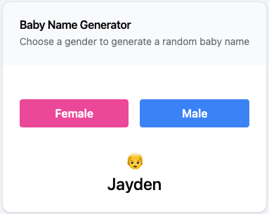

# Name Generator

- [Name Generator](#name-generator)
  - [Description](#description)
  - [Scope of Work](#scope-of-work)
  - [Technologies Used](#technologies-used)
  - [How to Run Project](#how-to-run-project)
  - [Screenshots](#screenshots)


## Description

Welcome to the Name Generator app project! The primary objective of this project is to develop a user-friendly application for generating baby names. Our focus is to strike a balance between selecting popular names without always suggesting the most common ones. To achieve this, our name generator will be guided by underlying statistical data to provide meaningful and unique name suggestions.

## Scope of Work

Build a Name Generator application that serves as a practical and interactive tool for expecting parents or anyone interested in discovering unique yet popular baby names. The key features and functionalities of this application include:

- [x] **User Interface**:  
  - [x] Create a new page or screen within the application.
  - [x] Add two buttons with labels "Female" and "Male" to the screen.
- [x] **Implement Button Click Event Handling**: 
  - [x] Define event handlers for the "Female" and "Male" buttons to respond to user clicks.
- [x] **Random Name Selection Logic**: Implement a function or algorithm to select a name from the provided dataset. This function should consider the gender selected (Female or Male) and choose a name accordingly.
- [x] **Display Selected Name**: 
  - [x] Create a card or a visually appealing container in the UI to display the selected name.
  - [x] Ensure that the selected name is prominently displayed in the card.

## Technologies Used

  React, Typescript, TailwindCSS

## How to Run Project

1. Clone the repository.
   ```bash
   git clone https://github.com/ruijadom/trip-planner.git
   cd trip-planner

2. Install dependencies.
   ```bash
   npm install
   ```

3. Start the development server.

    This command starts the mock server and the client app concurrently.


   ```bash
    npm run dev
    ```
4. Open [http://localhost:3000](http://localhost:3000) with your browser to see the result.


## Screenshots

